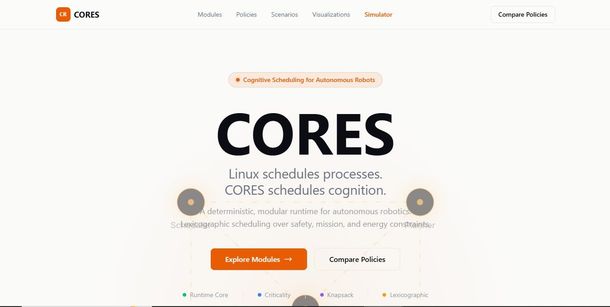

# CORES

**Cognitive Operating Runtime for Embodied Systems**

A robot has one battery, one CPU, and one chance to get home.

CORES is a deterministic, synchronous runtime that decides **which cognitive modules run, in what order, and under what constraints** - every cycle, with provable behavior. It is not the robot's brain. It is the infrastructure that keeps the brain from burning out.

---

---

## Why CORES?

Autonomous robots run multiple cognitive processes: perception, planning, localization, safety monitoring, fault recovery. In an ideal world, they all run simultaneously. In the real world:

- The battery is finite
- The CPU has a budget
- The mission has a deadline
- The environment is hostile

CORES solves a specific problem: **given finite resources and a changing world, which modules should execute this cycle to maximize mission success without violating safety constraints?**

Think of it as a real-time scheduler, but for cognition rather than processes.

---

## What Makes This Different

| Concern | Typical Approach | CORES |
|---      |---               |---    |
| Scheduling | Priority-based (static) or RTOS (deadline-driven) | **Criticality scoring + multi-objective optimization** |
| Adaptiveness | Fixed policies | **5 policies in progressive complexity**, from trivial to lexicographic Pareto DP |
| Evidence | Anecdotal | **Every claim backed by reproducible benchmarks, ablation studies, and Monte Carlo trials** |
| Safety | Best-effort | **Lexicographic: safety coverage > mission utility > energy > time** |
| Architecture | Monolithic | **Clean strategy pattern with strict component boundaries** |
| Determinism | Non-deterministic | **Fully deterministic - same inputs always produce the same plan** |

---

## Current Capabilities

Today CORES includes:

- **Deterministic runtime** - synchronous, single-threaded, same inputs always produce the same plan
- **Five scheduling policies** - Default, Priority, Criticality, Knapsack, Lexicographic
- **State Estimation subsystem** - cognitive node with 6 interchangeable physical reasoning strategies
- **Runtime bridge** - InMemory and WebSocket transports for live streaming runtime state
- **Runtime replay & simulator** - interactive browser-based simulator with live/replay modes
- **Benchmark framework** - microbenchmarks for latency, tracking accuracy, prediction error
- **Validation framework** - comparison, sensitivity, ablation studies, Monte Carlo evaluation
- **Research documentation** - every hypothesis, result, and finding documented alongside the code

---

## Architecture

```
Runtime (orchestrator)
├── StateEstimator   → RobotState
├── EventBus         → internal pub/sub
├── Scheduler
│   ├── SchedulingPolicy
│   │   ├── CriticalityScoringStrategy
│   │   └── ModuleSelectionStrategy
│   └── (Pluggable: 5 implementations)
├── ExecutionLayer   → module execute()
├── StateEstimation  → cognitive node: physical understanding
│   ├── ObservationAssociation
│   ├── SensorFusion
│   ├── PhysicalReasoning
│   ├── ConsistencyChecker
│   ├── ConfidenceManager
│   └── WorldModelStrategy (6 implementations)
├── RuntimeBridge    → snapshot transport
│   ├── InMemoryRuntimeBridge
│   └── WebSocketRuntimeBridge → JSON stream
└── Modules          → user-defined cognitive processes
```

**Design invariants:**
- `RobotState` is the single source of truth
- Only the scheduler produces execution plans
- Only the execution layer invokes modules
- The event bus knows nothing about other components
- The bridge is the only boundary between runtime internals and external consumers

---

## Quick Start

```bash
cd cores/
pip install -r requirements.txt
python -m pytest
```

---

## Documentation

| If you want to... | Start here |
|---|---|
| Understand the scheduler | [docs/scheduling.md](docs/scheduling.md) - policies, execution cycle |
| Learn how physical understanding works | [docs/state-estimation.md](docs/state-estimation.md) - 6 strategies, benchmarks |
| See what's built and what's next | [docs/status.md](docs/status.md) - phase table, key findings |
| Study the component boundaries | [docs/architecture.md](docs/architecture.md) - design invariants |
| Run tests, benchmarks, linting | [docs/commands.md](docs/commands.md) - full command reference |
| Explore the interactive homepage | [docs/homepage.md](docs/homepage.md) - Next.js site, simulator |
| Read research reports | [research/](research/) - experiments, design docs, evaluations |

---
