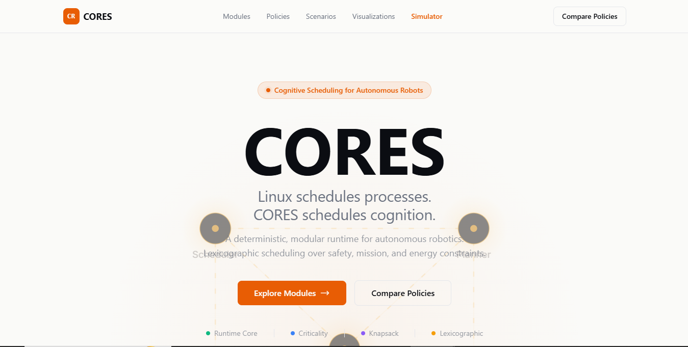

# CORES

**Cognitive Operating Runtime for Embodied Systems**

A robot has one battery, one CPU, and one chance to get home.

Every cycle, CORES decides which cognitive modules run, in what order, and under what constraints. It is not the robot's brain. It is the infrastructure that keeps the brain from burning out.

---


*The CORES homepage. You can open the simulator in your browser right now.*

---

## What It Does

Autonomous robots run many things at once: perception, planning, localization, safety monitoring, fault recovery. In an ideal world, they all run simultaneously. In the real world:

- The battery is finite
- The CPU has a budget
- The mission has a deadline
- The environment is hostile

CORES solves one specific problem: **given finite resources and a changing world, which modules should execute this cycle to maximize mission success without violating safety constraints?**

Think of it as a real-time operating system, but for cognition rather than processes.

---

## What You Can Do With It Today

**Run the runtime from Python:**

```bash
cd cores/
pip install -r requirements.txt
python -m pytest    # 696 tests pass
```

The runtime is a deterministic, synchronous engine. Same inputs always produce the same plan. It comes with 5 scheduling policies (Priority, Criticality, Knapsack, Lexicographic, Default), a StateEstimation module with 6 pluggable world model strategies, a Planning subsystem with 6 strategies, a Mission Manager that picks which goal to pursue right now, a Memory node with episodic and semantic stores plus a consolidation Logger, and a WebSocket bridge for live streaming.

**Watch it drive a rover on Mars in your browser:**

```bash
cd cores/homepage/
npm run dev
```

Then localhost:3000 in your browser.
OR Just:
Open [Website link](https://cores-rust.vercel.app/) and click Simulator to see a live dashboard. Click 3D Replay to watch a rover navigate a 500m Martian traverse. Rock falls. Dust storm hits. Battery drains. The runtime reacts. You see every decision, every module wake/sleep, every sensor reading.

---

## Architecture

```
Runtime (orchestrator)
|-- StateEstimator       reads sensors, updates RobotState
|-- EventBus             internal pub/sub (no module talks to another directly)
|-- StateEstimation      physical understanding: observe, associate, fuse, predict, reason, check, explain
|   +-- WorldModelStrategy (6 implementations)
|-- Memory               episodic + semantic stores, consolidation
|   +-- EpisodicStore    raw records (FIFO / Priority / TimeDecay / Episodic)
|   +-- Logger           compresses archived records into narratives (SPSCA)
|   +-- SemanticStore    narratives + facts + confidence
|-- Planner              propose candidate plans (6 strategies)
|-- MissionManager       picks the active mission and active goal
|-- Scheduler            picks which modules run this cycle
|   +-- SchedulingPolicy (5 implementations)
|-- ExecutionLayer       calls module.execute()
|-- RuntimeBridge        snapshots state for external consumers
    +-- InMemoryBridge
    +-- WebSocketBridge
```

**The rules are simple:**
- Only the scheduler produces execution plans
- Only the execution layer invokes modules
- The event bus knows nothing about other components
- The bridge is the only boundary between runtime internals and the outside world

---

## Why This Approach

I tried several scheduling approaches while building CORES. Some were simple priority schedulers, others used optimization. I kept benchmarking each version and gradually improved the runtime instead of trying to build the "best" scheduler from the start.

The results are documented. Some hypotheses failed. Those are documented too.

---

## What's Inside

| Area | What |
|---|---|
| Runtime | Deterministic cycle, EventBus, Module interface, RobotState |
| Schedulers | Priority, Criticality, Knapsack, Lexicographic, Default |
| StateEstimation | 6 world model strategies, 8 sub-components |
| Memory | EpisodicStore + SemanticStore + Logger (SPSCA consolidation) |
| Planning | 6 strategies (Reactive, Utility, GoalPlanner, BehaviorTree, HTN, MemoryAware) |
| Mission Manager | Lifecycle, goal lifecycle, priority selection, policies |
| Bridge | InMemory + WebSocket for live state streaming |
| Homepage | Next.js 14 site with docs, charts, interactive simulator, 3D Mars replay |
| Research | Benchmark results, validation studies, experiment reports |
| Tests | 696 tests, microbenchmarks, cross-strategy contract tests |

---

## Quick Start

```bash
# Python runtime
cd cores/
pip install -r requirements.txt
python -m pytest

# Browser homepage
cd cores/homepage/
npm install
npm run dev
```

---

## Documentation

| If you want to... | Start here |
|---|---|
| Understand the scheduler | [docs/scheduling.md](docs/scheduling.md) |
| See how StateEstimation works | [docs/state-estimation.md](docs/state-estimation.md) |
| Learn how Memory + Logger work | [docs/memory.md](docs/memory.md), [docs/logger.md](docs/logger.md) |
| See how mission selection works | [docs/mission-manager.md](docs/mission-manager.md) |
| Check what's built and what's next | [docs/status.md](docs/status.md) |
| Study the architecture decisions | [AI-Instructions/ADR/](AI-Instructions/ADR/) |
| Run tests, benchmarks, linting | [docs/commands.md](docs/commands.md) |
| Explore the homepage and simulator | [docs/homepage.md](docs/homepage.md) |
| Read research reports | [research/](research/) |

---

CORES is not an AGI project. It is not a chatbot. It is not a replacement for ROS 2. It is a cognitive runtime that any robotic system can depend on.
